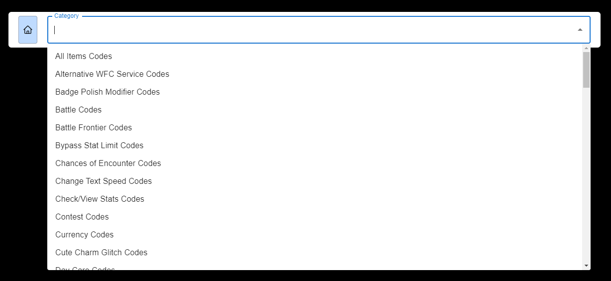

# Cheatbase

This is for Pokemon DS emulator cheats. It stores a comprehensive list of cheats for Pokemon games. You need to have a general idea of what you're looking for, but once you have an idea, it's easy to find the cheat you're looking for.

## How to use

1. Go to [Cheatbase](https://cheatbase.qinbeans.net)
2. Select the country or origin of the game

  

3. Select the game you want cheats for

  

4. Select the category of cheats you want (it will list all categories, so you're not blindly searching)

  

5. Select the cheat you want
    - There are a number of ways to obtain the cheat you're looking for, the best way is to use the cheat search bar.

  

## Credits

I didnt collect the cheats, I scraped and sanitized the Libretro database.

[Libretro-Database](https://github.com/libretro/libretro-database)
